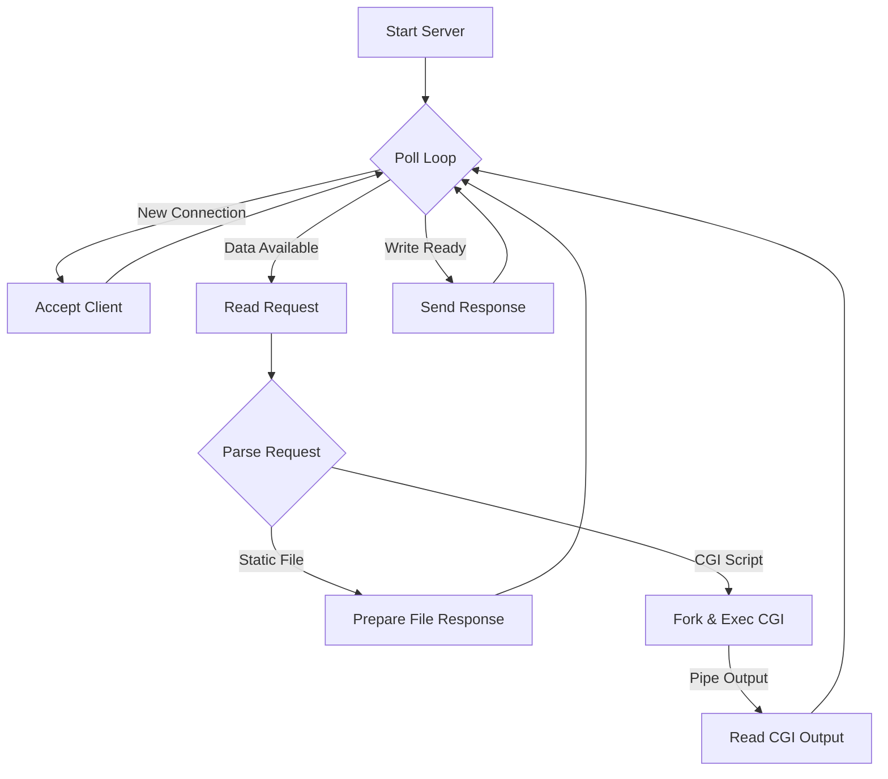

# High-Performance HTTP/1.1 Web Server

> A robust, non-blocking HTTP server implemented from scratch in C++98, featuring custom I/O multiplexing and a state-machine driven architecture.


## 📖 Introduction

This project is a fully functional HTTP/1.1 web server developed strictly following the C++98 standard. It was built to demonstrate deep understanding of Unix system programming, specifically in the domains of **Network Socket Programming**, **Non-blocking I/O**, and **Process Management**.

Unlike typical web servers that rely on heavy frameworks or modern libraries (like `boost::asio`), this server implements its own event loop using `poll()`, managing multiple concurrent client connections in a single thread without blocking. It supports serving static content, directory listings, and dynamic content via **CGI** (Common Gateway Interface).

## 🏗️ Architecture Overview

The server operates on an **Event-Driven Architecture**. At its core is a main loop that monitors file descriptors (sockets, pipes, files) for events.

### Core Components

1.  **The Event Loop (`Server::run`)**:
    - Uses `poll()` to monitor all active file descriptors.
    - completely non-blocking: The server never sleeps waiting for I/O operations.
    - Dynamically manages the `pollfd` vector, adding/removing descriptors as connections open/close or CGI processes start/finish.

2.  **State Machine (`State` Class)**:
    - Every connection is wrapped in a `State` object.
    - Tracks the lifecycle of a request: `Accept` -> `Read Request` -> `Parse` -> `Process/CGI` -> `Build Response` -> `Send`.
    - Allows the server to pause processing a specific client while waiting for I/O (e.g., waiting for a CGI script) and resume exactly where it left off.

3.  **I/O Multiplexing**:
    - **Client Sockets**: monitored for `POLLIN` (request) and `POLLOUT` (response).
    - **CGI Pipes**: Monitored to asynchronously read script output without blocking the main loop.
    - **File I/O**: Files are opened and read in chunks to ensure large file operations do not starve other connections.



## 🚀 Key Features

*   **Non-Blocking I/O**: All socket operations (read/write/accept) and CGI interactions are non-blocking.
*   **I/O Multiplexing**: Uses `poll(2)` (or `select`/`epoll` equivalents) to handle multiple connections simultaneously.
*   **HTTP/1.1 Compliance**:
    *   Supports `GET`, `POST`, `DELETE` methods.
    *   **Chunked Transfer Encoding** support for large requests/responses.
    *   Proper status code handling (200, 400, 403, 404, 405, 500, etc.).
*   **CGI Support**:
    *   Executes scripts (Python, PHP, Bash) dynamically.
    *   Passes environment variables (`PATH_INFO`, `QUERY_STRING`, etc.) compliant with the CGI 1.1 standard.
    *   Manages pipes and forks manually (`pipe()`, `fork()`, `execve()`, `dup2()`).
*   **Custom Configuration**:
    *   Parses Nginx-like configuration files.
    *   Supports server blocks, location blocks, error pages, client body size limits, and index files.

## 🛠️ Technical Challenges & Solutions

### 1. Memory Management in C++98
**Challenge**: C++98 lacks smart pointers (`std::shared_ptr`, `std::unique_ptr`), making memory leaks a high risk.
**Solution**: Implemented strict RAII (Resource Acquisition Is Initialization) patterns and careful manual memory management. Request/Response objects are owned by the `State` class, which is tightly lifecycle-managed by the Server's map of active connections.

### 2. Handling Partial I/O
**Challenge**: `recv()` and `send()` might not process all data at once in non-blocking mode.
**Solution**: Buffering systems were implemented. The Request parser can handle fragmented packets, assembling them until a full HTTP message is ready. Similarly, the Response sender tracks bytes sent and resumes transmission on the next `POLLOUT` event.

### 3. CGI Process Management
**Challenge**: Waiting for a child process (`waitpid`) blocks the server.
**Solution**: The server does NOT wait. It sets up pipes to the child process and adds them to the `poll` set. The server reads from the pipe when data is available. If the pipe closes, the server knows the CGI is finished.

## ⚙️ Installation & Usage

### Prerequisites
*   A Linux/Unix-based operating system.
*   A C++ compiler compliant with C++98 (e.g., `g++` or `clang++`).
*   `make`.

### Build
Compile the project using the provided Makefile:
```bash
make
```

### Run
Start the server with a configuration file:
```bash
./webserv [config_file]
```
*If no configuration file is provided, `config.txt` is used by default.*

## 📝 Configuration Guide

The server is highly configurable via an Nginx-style config file. You can define ports, hostnames, error pages, and route-specific rules (CGI handlers, upload directories, etc.).

**[📄 Detailed Configuration Documentation & Rules](https://zigzag-cardinal-326.notion.site/Webserv-config-file-rule-b6699cd04f4a476ca5573f33832196a9?pvs=4)**
*(Please refer to this document for strict syntax rules and available directives)*

### Example Config Snippet
```nginx
server {
    listen 8080;
    server_name localhost;
    error_page 404 /404.html;

    location / {
        root ./pages;
        index index.html;
        allow_methods GET POST;
    }

    location /cgi-bin {
        root ./utils;
        cgi_pass .py .sh;
    }
}
```

## ⚖️ Performance & Scalability

By utilizing **Synchronous I/O Multiplexing**, this server avoids the context-switching overhead associated with "Thread-per-Request" models. This makes it extremely lightweight. It serves multiple clients concurrently using a single execution thread, limited primarily by the operating system's file descriptor limits and network bandwidth.
